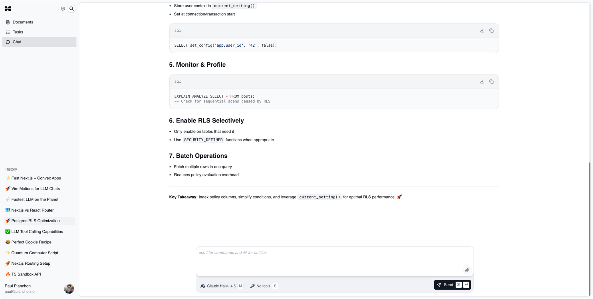

# Karnet

Karnet is a new kind of productivity tool for product builders. Seamlessly integrating note-taking, research, task management, calendar scheduling, and engineering documentation, Karnet is designed to help you move faster and think deeper—all powered by state-of-the-art AI.

## Features

- **AI-First Chat**  
  Access all the latest AI models in a blazing-fast, keyboard-first chat interface. Get instant answers, brainstorming help, or generate content with ease.

- **Task Management**  
  Create and manage tasks, assign them to yourself or others, and track progress in a clear, collaborative environment.

- **Engineering Documentation**  
  Write requirement docs, draw architecture diagrams, and use Mermaid syntax—all within the editor.

- **Calendar Scheduling**  
  Automatically schedule your tasks into your calendar, maximizing productivity and reducing stress.

## Waitlist

Karnet is currently in private beta.  
**[Join the waitlist](https://karnet.app/waitlist)** to experience the future of productivity and help shape its direction.

## Technologies 
Karnet leverages the following technologies:

- **Next.js**: The React framework powering fast server-side rendering and static site generation.
- **Clerk**: Secure authentication, user management, and waitlists.
- **Convex**: Developer-friendly, type-safe backend for real-time data, storage, and business logic.
- **AI SDK**: Integrates the latest AI language models for smart features and productivity tooling.
- **Trigger.dev**: Automated background jobs and workflow orchestration tied to product events.

## Contributing

We're not open source yet, but we're always looking for feedback and collaborators!  
Open an issue or reach out if you're interested.

## License

© 2025 Karnet. All rights reserved.

